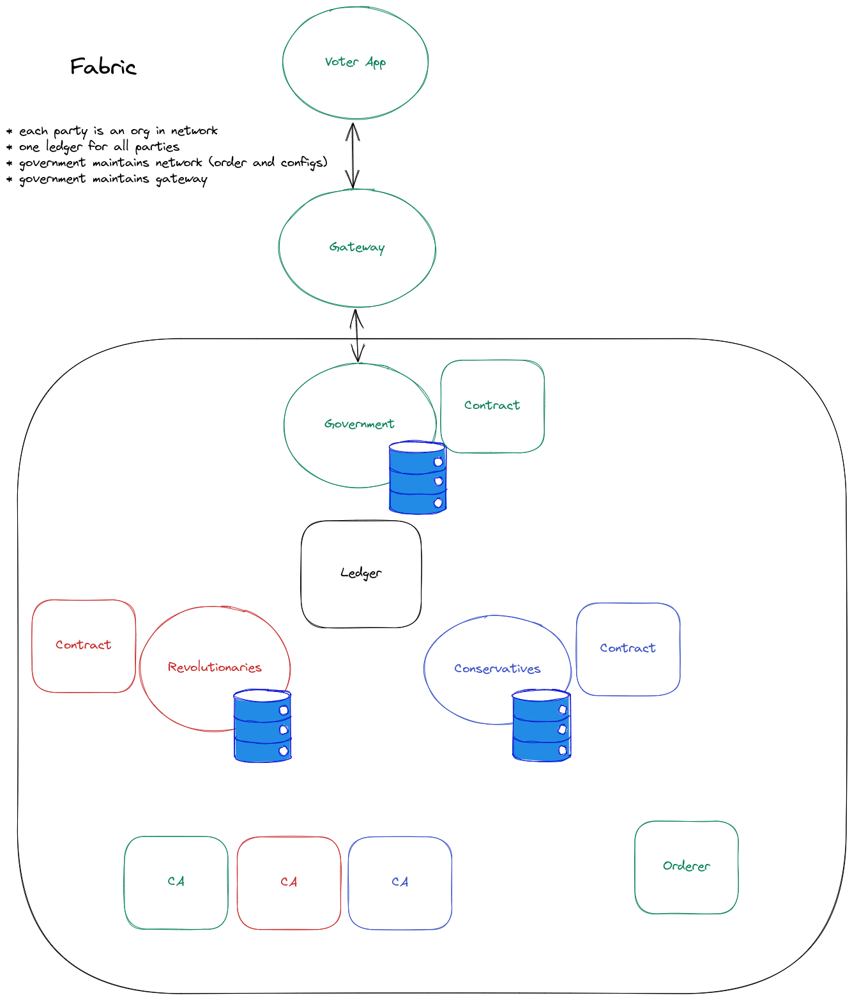

# Trustless Elections Platform

POC project backed by [Hyperledger Fabric](https://www.hyperledger.org/use/fabric). No production use intended.

## Overview

The goal is to utilize blockchain for voting on governmental decisions.
Blockchain players are:
* government - manages platform
* parties - take part in consensus
* voters - usual users

### Diagram


[Excalidraw](https://excalidraw.com/) used to draw diagram. [Diagram source](./diagram.excalidraw) is checked-in as well.

System has 4 main parts:

1. Fabric network (see [./local-network](./local-network)).
2. Elections contract (see [./chaincode](./chaincode/)).
3. REST-like Gateway (see [./gateway](./gateway/)).
4. Voter front-end app. Usual React app for actual voters.

## Deployment

Steps to run both apps locally:

1. Start network (see [readme](./local-network/))
2. Start up gateway (see [readme](./gateway/))
3. Start up front-end (see [readme](./voter-dapp/))

## Usage

Create elections through gateway:
```shell
curl \
    -u john:Password1!
    -H "Content-Type: application/json" \
    -d "$(python local-network/generate_election.py)" \
    http://localhost:8080/elections
```

Visit http://localhost:3000 in your browser view elections and vote there.
