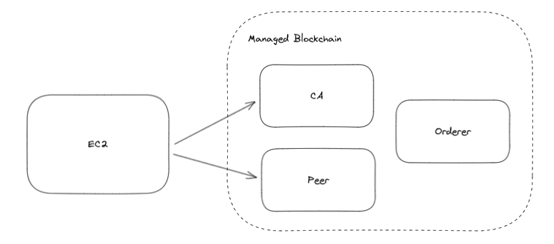

# Voting platform network

Uses AWS CDK to deploy network and one client to AWS.



## Deployment

The `cdk.json` file tells the CDK Toolkit how to execute your app.

 * `cdk diff` - compare deployed stack with current state 
 * `cdk deploy [--hotswap]` - deploy this stack to your default AWS account/region

## Usage

Connect to EC2 client:
```shell
# retrieve ssh private key
aws ssm get-parameter \
  --name /ec2/keypair/$(aws ec2 describe-key-pairs --key-names FabricEC2Key | jq -r ".KeyPairs[0].KeyPairId") \
  --with-decryption \
  | jq -r ".Parameter.Value" > ec2.pem

chmod 600 ec2.pem

# retrieve ec2 address
EC2_PUBLIC_DNS=$(aws ec2 describe-instances \
    --filters Name=tag:Name,Values=ElectionsAwsStack/FabricClient/FabricEC2Client \
    | jq -r ".Reservations[0].Instances[0].PublicDnsName")

# ssh into ec2 using private key
ssh -i ec2.pem ec2-user@$EC2_PUBLIC_DNS
```

Interact with chaincode:
... - not working for now see this [fixme](./resources/client-data.sh#L95)
